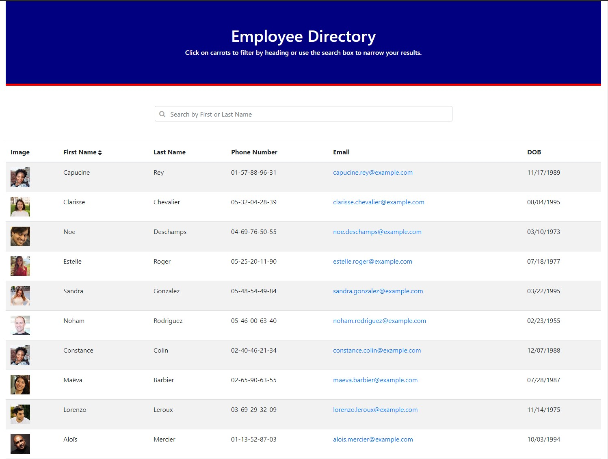

# Employee Directory
create a employee directory with React

## Description 
The user will be able to view my entire employee directory at once so that they have quick access to the information.

## Table of Contents
* [Installation](#installation)
* [Usage](#usage)
* [License](#license)
* [Questions](#questions)

## Installation

*Steps required to install project and how to get the development environment running:*

1. Download or clone repository
2. Node.js & React is required to run the application
3. `npm install` to install the required npm packages

## Usage

* To start using the application, open your browser and go to
  
  `http://localhost:3000/`

* A live demo is available on the link below:
    * [Github Pages](https://grider27.github.io/employee-directory/)

* Screenshot of the Application:

## License

MIT License

---

## Questions

* Please submit any questions at my [GitHub profile](https://github.com/grider27)

* Also, you can reach me via email @ grider27@gmail.com